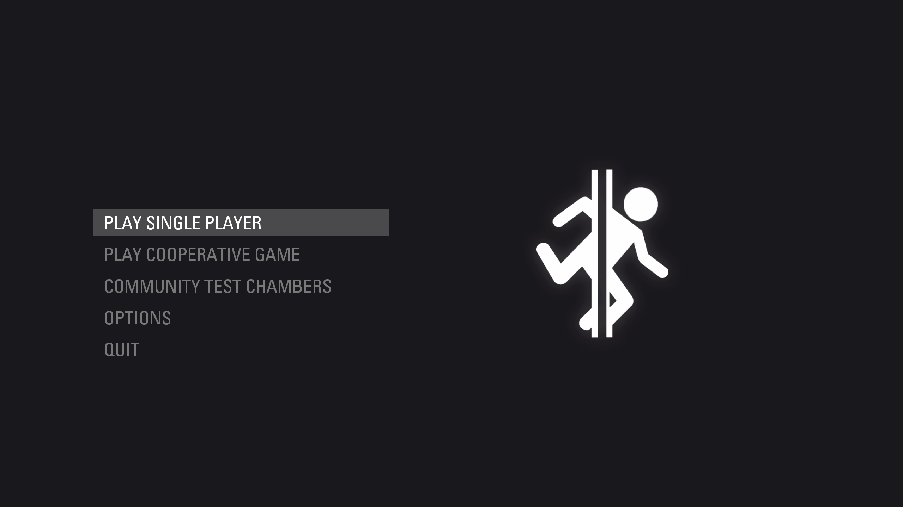

# Portal 2 Clean UI Theme (WIP)
[Installation](https://github.com/MrSlimeDiamond/p2-cleanui#installation) | [Inspiration](https://gamebanana.com/mods/22973) | [Issues](https://github.com/MrSlimeDiamond/p2-cleanui/issues)

## !!! WARNING !!!
This is not allowed in any% speedruns because it removes buttons on the main menu screen which can provide an advantage.

## Installation
Go to the [releases](https://github.com/MrSlimeDiamond/p2-cleanui/releases)
 
Download `pak01_dir.vpk`, put it in a new DLC folder (if you don't have one, make a `portal2_dlc3` folder in `Portal 2/`)

Copy everything in `media/` into `Portal 2/portal2/media` (don't worry, there's a copy of the default backgrounds!)

## Uninstallation
Remove the `pak01_dir.vpk` from `portal2_dlcX`

Delete all `menu_act0X` (NOT THE COPIES) from `Portal 2/portal2/media`

Rename all the copies to remove the `- Copy`
